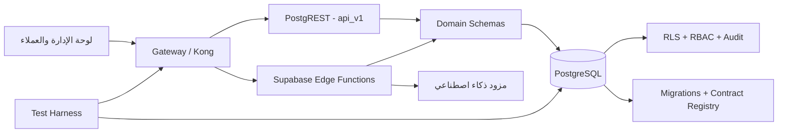

# Qarar | قرار

<div dir="rtl" style="text-align: right;">

**منصة عربية مفتوحة المصدر لإدارة الحوكمة المؤسسية والمجالس والاجتماعات واللوائح والقرارات.**

[](LICENSE)


> **حالة المشروع:** تطوير نشط. يحتوي فرع `dev` على نواة خلفية متقدمة واختبارات أمن وعزل مؤسسات، لكن المشروع لا يُعد إصدارًا إنتاجيًا عامًا قبل اكتمال مراجعة النشر والأمان وربط الواجهات.

## ما هو Qarar؟

`Qarar` منصة `Enterprise Governance & Decision Management` تساعد الجامعات والجهات العامة والمؤسسات واللجان على إدارة دورة الحوكمة كاملة بصورة قابلة للتتبع:

```text
الموضوع
→ المراجعة والإحالة
→ اللائحة والمسار الحاكم
→ المجلس والاجتماع
→ الحضور والنصاب
→ التصويت
→ المحضر والمصادقة البشرية
→ القرار والتنفيذ والمتابعة
```

المشروع عربي أولًا، متعدد المؤسسات، ويهدف إلى توفير بنية قابلة لإعادة الاستخدام بدل بناء أنظمة منفصلة وغير مترابطة لكل مجلس أو جهة.

## الجهات المستهدفة

- الجامعات والكليات والأقسام العلمية.
- الوزارات والهيئات والمؤسسات العامة.
- مجالس الإدارة واللجان الدائمة والمؤقتة.
- المنظمات غير الربحية والمؤسسات الكبيرة.
- فرق التطوير والباحثون في الحوكمة الرقمية العربية.

## الحالة الحالية

النواة المنفذة على `dev` تشمل:

| المجال | الحالة |
|---|---|
| تعدد المؤسسات وعزل البيانات | منفذ مع اختبارات RLS وCross-Tenant |
| IAM وRBAC وإدارة الصلاحيات | منفذ |
| الموضوعات والمراجعة والإحالات | منفذ |
| الاجتماعات وجدول الأعمال | منفذ |
| إدارة المجالس والعضويات والقيادة | منفذ |
| الحضور والنصاب والتصويت | منفذ |
| اللوائح والإصدارات والنطاقات والمسارات | منفذ |
| توليد مسودة المحضر بالذكاء الاصطناعي | منفذ ضمن مسار مضبوط |
| مراجعة المحضر والمصادقة البشرية | منفذ |
| القرارات والتنفيذ والمتابعة | نواة منفذة وتخضع للتطوير والتحسين |
| لوحة الإدارة | قيد الدمج والتطوير النشط |
| التقارير والامتثال والتنبيهات المتقدمة | ضمن خارطة الطريق |

## القدرات الأساسية

### الحوكمة والمجالس

- تعريف أنواع المجالس واللجان.
- إدارة شجرة المجالس ومنع العلاقات الدائرية.
- إدارة الأعضاء وفترات العضوية.
- تعيين الرئيس والمقرر وحفظ التاريخ.
- دورة حالة واكتمال إداري قابلة للتدقيق.

### الموضوعات والاجتماعات

- إنشاء الموضوعات ومراجعتها وإعادتها ورفضها وتأجيلها.
- إحالة الموضوعات بين الوحدات والمجالس.
- إدارة الاجتماعات وجدول الأعمال.
- منع الوصول المباشر غير المصرح به لجداول المجال.
- دعم Idempotency وOptimistic Concurrency.

### الحضور والنصاب والتصويت

- قوائم عضوية ثابتة للاجتماع.
- تسجيل حضور مضبوط والتحقق المستقل.
- حفظ Snapshot للنصاب.
- جولات تصويت ونتائج غير قابلة للتعديل الصامت.
- حماية من التزامن والكتابة المباشرة وتجاوز المسار.

### اللوائح ومحرك المسارات

- إدارة اللوائح وإصداراتها وبنودها ونطاقاتها.
- تطبيق اللوائح على مجالس أو فئات محددة.
- اكتشاف التعارضات والأولوية والفجوات.
- إنشاء مسار حوكمة ثابت لكل موضوع.
- ربط نتيجة التصويت بالانتقال المسموح فقط.

### المحاضر والذكاء الاصطناعي

- إنشاء كيان محضر مستقل مرتبط بالاجتماع.
- توليد **مسودة** أولية بالذكاء الاصطناعي.
- منع اعتبار المخرج الآلي محضرًا رسميًا.
- مراجعة وتحرير بشري.
- مصادقة بشرية قبل الإغلاق.
- حماية من الكتابة القديمة أو المتزامنة على المسودة.

### الأمان والتدقيق

- عزل مؤسسات متعدد الطبقات.
- RLS وصلاحيات دقيقة.
- عقود ثابتة عبر `api_v1`.
- وظائف داخلية مقيدة وأدوار تنفيذ محدودة.
- Audit Trail للعمليات الحساسة.
- اختبارات هجرة وتوافق وتراجع وأمان.

## المعمارية



يعتمد المشروع على تقسيم منطقي للوحدات، وعقود API معلنة، وترحيلات ذرية، مع فصل المسارات العامة عن الوظائف الداخلية الحساسة.

## التقنيات المستخدمة

| الطبقة | التقنية |
|---|---|
| قاعدة البيانات | PostgreSQL |
| المنصة الخلفية | Supabase Self-hosted |
| API | PostgREST وعقود `api_v1` |
| الأمن | RLS، RBAC، JWT، صلاحيات منفذ محدودة |
| الوظائف | Supabase Edge Functions / TypeScript |
| الاختبارات | SQL، Node.js، HTTP Integration Tests |
| التشغيل المحلي | Docker Compose |
| لوحة الإدارة | Next.js + TypeScript، قيد الدمج |
| الذكاء الاصطناعي | تكامل مضبوط لتوليد مسودات فقط |

## التشغيل محليًا

### المتطلبات

- Git
- Node.js وnpm
- Docker وDocker Compose
- Bash أو Git Bash/WSL لبعض السكربتات
- Supabase CLI عند استخدام أوامر `supabase:*`

### 1. استنساخ المشروع

```bash
git clone https://github.com/Al-Razi-System/Qarar.git
cd Qarar
git checkout dev
npm install
```

### 2. إعداد البيئة

```bash
cp supabase/docker/.env.example supabase/docker/.env
```

غيّر جميع الأسرار والقيم الافتراضية داخل `.env` قبل التشغيل. يمكن استخدام سكربتات توليد المفاتيح الموجودة في `supabase/docker/utils/` حسب تعليمات الملف البيئي.

### 3. التحقق والتشغيل

```bash
npm run docker:config
npm run docker:start
npm run docker:status
```

لإيقاف الخدمات:

```bash
npm run docker:stop
```

## الاختبارات

الأوامر المتاحة في المشروع تشمل:

```bash
npm run test:iam-edge
npm run test:iam-http
npm run test:sprint01-http
npm run test:sprint03-http
npm run test:sprint035-http
npm run test:sprint036-http
npm run test:compatibility
npm run test:api-docs
```

تتطلب اختبارات HTTP تشغيل بيئة Docker وإعداد البيانات والأسرار المناسبة. راجع سكربتات `supabase/tests/` وملف Workflow في `.github/workflows/` لمعرفة البوابة الكاملة لكل نطاق.

## لقطات الواجهة

لوحة الإدارة قيد الدمج ضمن [PR #126](https://github.com/Al-Razi-System/Qarar/pull/126). لا توجد حاليًا لقطات واجهة ملتزمة على فرع `dev`، ولذلك لا يعرض هذا README صورًا تجريبية أو روابط مكسورة.

بعد دمج الواجهة، توضع اللقطات المعتمدة في:

```text
docs/assets/screenshots/
├── login.png
├── dashboard.png
├── councils.png
├── regulations.png
├── meetings.png
└── voting.png
```

ثم تُعرض هنا مع رقم الإصدار أو Commit الذي تمثلّه.

## خارطة الطريق

### Release 1 — النواة المؤسسية

- استكمال تكامل لوحة الإدارة.
- تثبيت عقود المجالس واللوائح والاجتماعات والمحاضر.
- إغلاق فجوات الواجهة مع `api_v1`.
- مراجعة الأمان وعزل المؤسسات.
- توثيق التشغيل والنشر والإصدارات.

### Release 1.x — التشغيل والامتثال

- تقارير التغطية والامتثال.
- Outbox والتنبيهات والتصعيد.
- تحسين القرارات والتنفيذ والمتابعة.
- تحسين الأداء والمراقبة والنسخ الاحتياطي.
- حزم بيانات ولوائح نموذجية قابلة للاستيراد.

### Release 2 — التوسع

- تكاملات مؤسسية وSSO موسعة.
- تحليلات ولوحات مؤشرات متقدمة.
- توطين إضافي وتوسيع دعم المؤسسات.
- خيارات نشر وإدارة متعددة.

خارطة الطريق التفصيلية موجودة في [وثيقة التنفيذ](docs/21_Implementation_Roadmap_Qarar_Arabic.md) ووثائق الإصدارات والسبرنتات داخل `docs/`.

## التوثيق

للبدء السريع:

1. [القاموس المرجعي](docs/00_Glossary_Qarar_Arabic.md)
2. [وثيقة الرؤية](docs/01_Vision_Document_Qarar_Arabic.md)
3. [إطار الحوكمة](docs/05_Governance_Framework_Qarar_Arabic.md)
4. [نموذج البيانات](docs/07_Data_Model_Qarar_Arabic.md)
5. [إطار سير العمل](docs/08_Workflow_Framework_Qarar_Arabic.md)
6. [إطار الأمن](docs/15_Security_Framework_Qarar_Arabic.md)
7. [إطار الصلاحيات](docs/16_Permission_Framework_Qarar_Arabic.md)
8. [معمارية SaaS](docs/17_SaaS_Architecture_Qarar_Arabic.md)
9. [إطار الذكاء الاصطناعي](docs/18_AI_Framework_Qarar_Arabic.md)
10. [مواصفات API](docs/19_API_Specification_Qarar_Arabic.md)
11. [خارطة التنفيذ](docs/21_Implementation_Roadmap_Qarar_Arabic.md)
12. [استراتيجية الاختبار](docs/29_Testing_And_Quality_Assurance_Strategy_Qarar_Arabic.md)
13. [دليل GitFlow](docs/gitflow-qarar.md)

مرجع عقود API التنفيذية موجود في [`supabase/docs/api/`](supabase/docs/api/README.md).

## المساهمة

نرحب بالمساهمات في الكود والتوثيق والاختبارات والأمن وتجربة الاستخدام العربية.

قبل البدء، اقرأ:

- [دليل المساهمة](CONTRIBUTING.md)
- [سياسة الأمان](SECURITY.md)
- [مدونة السلوك](CODE_OF_CONDUCT.md)

افتح Issue قبل التغييرات الكبيرة، واربط كل PR بمشكلة واضحة ومعايير قبول واختبارات مناسبة.

## الترخيص

هذا المشروع متاح وفق [Apache License 2.0](LICENSE).

> قبل اعتماد الترخيص نهائيًا، يجب على الجهة المالكة التأكد من امتلاكها حقوق إعادة ترخيص جميع المكونات المضمّنة وعدم وجود مكونات منسوخة بترخيص غير متوافق.

## English Summary

Qarar is an Arabic-first, open-source enterprise governance and decision-management platform for universities, public institutions, boards, and committees. It provides multi-tenant governance workflows for councils, regulations, meetings, attendance, quorum, voting, minutes, decisions, RBAC, audit trails, and secure API contracts.

The project is under active development. Contributions in security, testing, documentation, Arabic UX, governance modeling, and integrations are welcome.

</div>
