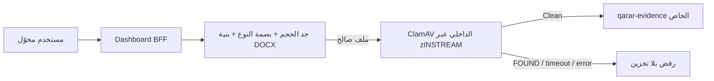

# تشغيل فحص برمجيات خبيثة للمرفقات

هذا الدليل يضبط مساري مرفقات الموضوعات واللوائح في لوحة التحكم (`/api/admin/topics/upload` و`/api/admin/regulations/upload`). وهو جزء من بوابة النشر الإنتاجي؛ لا يبرر نجاح بناء الصورة تعطيل هذا المسار أو تجاوزه.

## حدّ الثقة وتسلسل المعالجة



- أقصى حجم للملف وطلب multipart هو `25 MiB`؛ ولا يمكن رفع قيمة الماسح فوق هذا الحد من البيئة.
- يرفض BFF الامتداد أو MIME الذي يرسله المتصفح، ويتحقق من بصمة الملف ومن عضوي OpenXML الإلزاميين في DOCX.
- لا يُنشأ كائن في `qarar-evidence` ولا سجل مرفق قبل أن تكون نتيجة الماسح `Clean`.
- النتيجة المصابة تعود `422` برسالة عامة. فشل الاتصال أو المهلة أو الإعداد تعود `503` ورسالة عامة؛ لا تُسجل أسماء التواقيع أو محتوى الملف أو مفاتيح الخدمة.
- لا توجد منطقة تخزين quarantine دائمة للملفات المرفوضة. العزل هنا مؤقت في ذاكرة BFF ثم الرفض؛ وهذا متعمد لتجنب الاحتفاظ بمرفقات حكومية غير موثوقة أو خبيثة. يحتاج الاحتفاظ القانوني بعيّنة إلى نظام تحليل معزول وسياسة احتفاظ وموافقة مستقلة، وليس bucket عام.

## مكوّنات الإنتاج

يعرف ملف `deploy/production/docker-compose.production.yml` خدمة `clamav` الرسمية، ولا ينشر المنفذ `3310` على المضيف:

- تصل لوحة التحكم وClamAV فقط إلى شبكة `upload-scanner` الداخلية.
- يصل ClamAV إلى شبكة `clamav-updates` المنفصلة لتحديث قواعد التواقيع فقط. لا تصل أي خدمة تطبيق أخرى إلى هذه الشبكة.
- تعمل حاوية ClamAV بجذر للتهيئة القصيرة فقط ثم يسقط entrypoint إلى مستخدم `clamav`. أُبقيت فقط capabilities اللازمة لملكيّة حجمي الإعداد/قاعدة التواقيع؛ لا يوجد `NET_BIND_SERVICE` ولا وصول إلى Docker socket أو ملفات المضيف.
- يفرض التطبيق `QARAR_UPLOAD_SCAN_HOST=clamav` و`QARAR_UPLOAD_SCAN_PORT=3310` و`QARAR_UPLOAD_SCAN_ADAPTER=clamav-internal` حرفيًا. لا يقبل URL أو عنوان IP أو hostname يرسله عميل أو مشغّل.
- ينتظر Compose صحة `clamd` قبل بدء لوحة التحكم. وبعد البدء، يفحص كل رفع الماسح نفسه؛ لذلك تعطل الماسح لاحقًا لا يتحول إلى رفع غير مفحوص.
- تضبط الخدمة `StreamMaxLength` و`MaxFileSize` و`MaxScanSize` على `26214400`، و`AlertExceedsMax=yes` كي لا تُعامل وثيقة تجاوزت حدود التحليل كوثيقة سليمة.

توجد قيمة `QARAR_UPLOAD_SCAN_REQUIRED=true` في قالب الإنتاج، ويفرضها فاحص البيئة. يجب أن تبقى القيم التالية متطابقة:

```dotenv
QARAR_UPLOAD_SCAN_REQUIRED=true
QARAR_UPLOAD_SCAN_ADAPTER=clamav-internal
QARAR_UPLOAD_SCAN_HOST=clamav
QARAR_UPLOAD_SCAN_PORT=3310
QARAR_UPLOAD_SCAN_TIMEOUT_MS=10000
QARAR_UPLOAD_SCAN_MAX_BYTES=26214400
```

في التطوير فقط، غياب `QARAR_UPLOAD_SCAN_REQUIRED` أو ضبطه على `false` يفعّل bypass موثقًا كي لا تتعطل واجهات المطور. لا يوجد bypass في `NODE_ENV=production`: أي قيمة مفقودة أو خاطئة تجعل الرفع يفشل بـ`503`.

## إجراءات النشر والتحقق

1. خزّن ملف البيئة الحقيقي في مخزن أسرار خارج المستودع، ثم شغّل:

   ```sh
   node scripts/validate-production-env.mjs /secure/qarar.env
   node --test scripts/upload-malware-scan-production-config.test.mjs
   ```

2. افحص ناتج Compose قبل التشغيل. يجب ألا ترى `ports:` ضمن خدمة `clamav`، ويجب أن تكون لوحة التحكم معتمدة على `clamav: service_healthy`:

   ```sh
   docker compose --env-file /secure/qarar.env \
     -f supabase/docker/docker-compose.yml \
     -f deploy/production/docker-compose.production.yml config
   ```

3. شغّل البيئة بـ`--wait` ثم تحقق من الماسح:

   ```sh
   docker compose --env-file /secure/qarar.env \
     -f supabase/docker/docker-compose.yml \
     -f deploy/production/docker-compose.production.yml up -d --build --wait

   docker compose --env-file /secure/qarar.env \
     -f supabase/docker/docker-compose.yml \
     -f deploy/production/docker-compose.production.yml ps clamav dashboard
   ```

4. نفّذ اختبار قبول مصرح به من حساب إداري تجريبي: ملف سليم مسموح يجب أن يعود بنجاح، وملف اختبار EICAR غير المؤذي (ضمن ملف يحوي البصمة المسموحة) يجب أن يعود `422`. راجع بعده أن عدد كائنات `qarar-evidence` لم يزد في حالة الرفض. لا تضع سلسلة EICAR أو ملفها داخل Git أو بيانات الإنتاج.

5. راقب `docker compose logs clamav` بعد كل تشغيل وتحديث. نجاح `clamdcheck.sh` يثبت أن daemon يستجيب، لكنه ليس بديلًا عن متابعة عمر قاعدة التواقيع ورسائل `freshclam`.

## متطلبات تشغيلية وحدود

- اسمح في جدار الحماية/egress الخاص بـ`clamav-updates` إلى مرآة ClamAV المعتمدة أو مرآة داخلية فقط، وسجّل اسم المرآة ومالكها. لا تسمح بالوصول الوارد إلى `3310` ولا تعرّضه عبر Reverse Proxy.
- احتفظ بحجمي `qarar-clamav-data` و`qarar-clamav-config` ضمن نسخ البنية، لكنهما لا يحتويان ملفات مرفقات المستخدمين. عند استعادة بيئة جديدة، انتظر حتى تكتمل قاعدة التواقيع ويصبح healthcheck أخضر قبل فتح الحركة.
- إذا تعطّل ClamAV أو أصبحت قاعدة التواقيع غير قابلة للتحديث، تبقى المنصة قابلة للقراءة والإدارة، لكن جميع الرفوع الجديدة تتوقف بـ`503`. لا تغيّر `QARAR_UPLOAD_SCAN_REQUIRED=false` كحل حادث؛ أصلح الماسح، أثبت الصحة، ثم أعد محاولة الرفع من المصدر.
- ClamAV فحص توقيعات وليس CDR أو sandbox أو DLP. الوثائق ذات المخاطر العالية قد تحتاج بوابة تحليل معزولة إضافية، تصنيف حساسية، وسياسة قانونية للاحتفاظ؛ أي تكامل جديد يجب أن يبقى internal allow-listed وأن يحافظ على قاعدة «لا تخزن إلا Clean».
