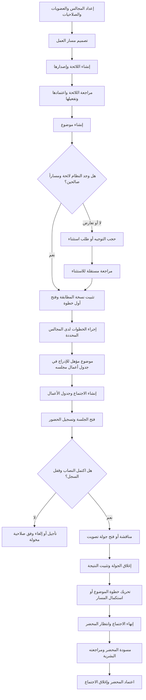
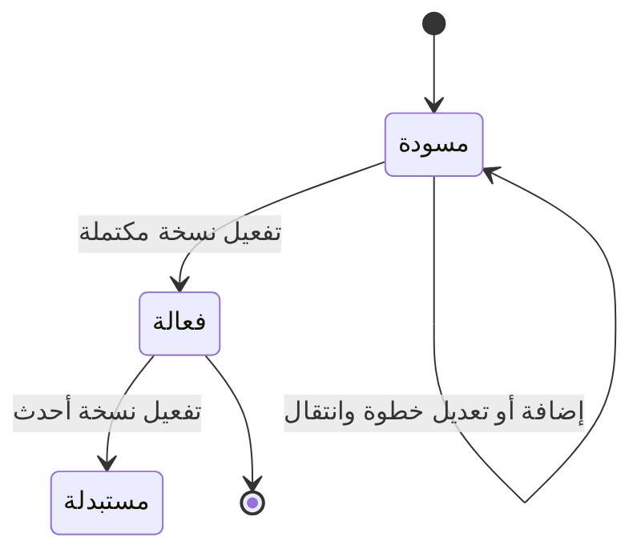
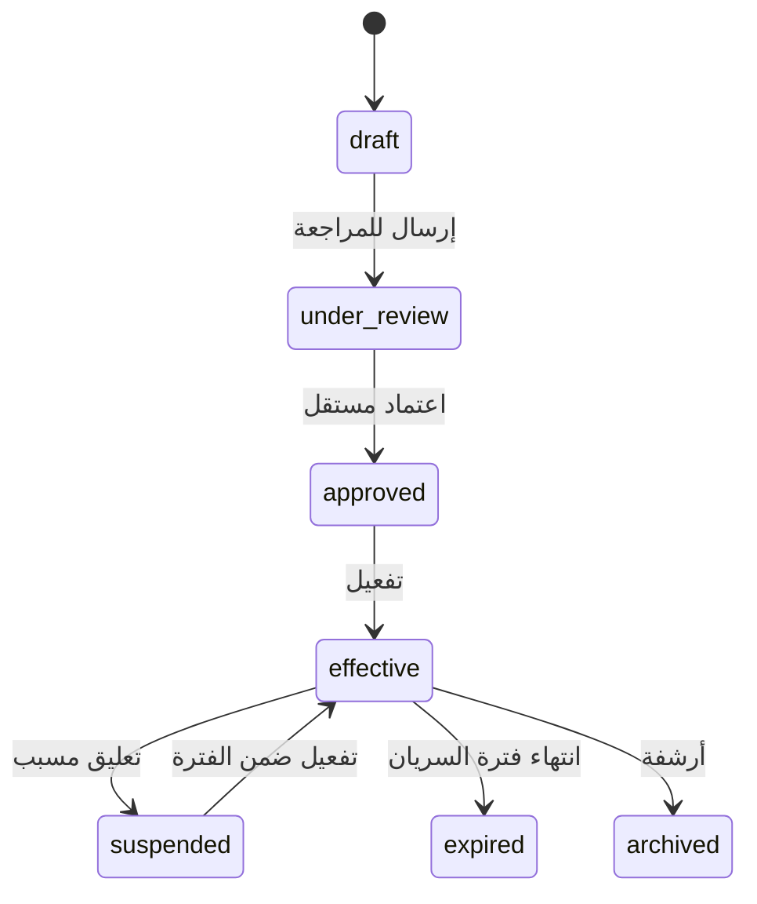
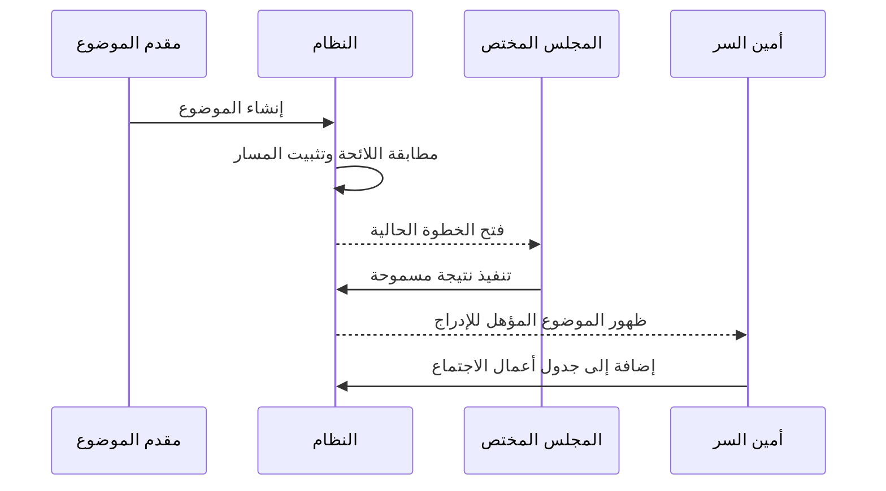
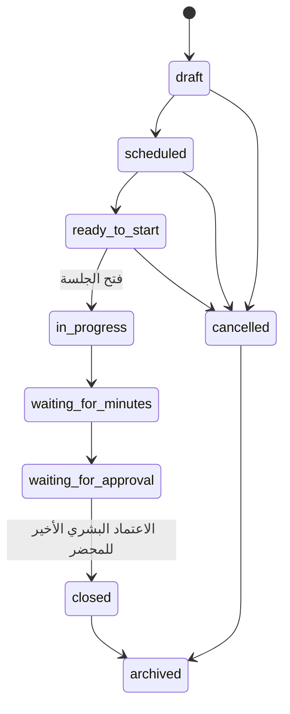

# الدليل التشغيلي العربي: من اللائحة إلى المحضر

هذا الدليل يشرح دورة العمل العملية للموضوع الخاضع للحوكمة، من إعداد اللائحة إلى إغلاق
الاجتماع بعد اعتماد المحضر. وهو موجه لمالك الحوكمة، أمين السر، رئيس المجلس، ومطور الواجهة.

لا تنشئ الواجهة أو تعدل الجداول مباشرة. كل إجراء في هذا الدليل يستدعي عقدًا موثقًا عبر
`api_v1`، وتتحقق الخدمة من هوية المستخدم وصلاحياته ونطاق مجلسه تلقائيًا.

## حدود الدليل

يغطي الدليل ما هو منفذ في مسار اللوائح والموضوعات والاجتماعات والحضور والتصويت والمحاضر.
إدارة القرار النهائي والتكليف والتنفيذ والمتابعة التفصيلية هي نطاق لاحق؛ لا ينبغي للواجهة أن
تبنيها على جداول أو عقود غير موثقة في هذا الإصدار.

## الصورة الكاملة

## المصطلحات التي يجب عدم خلطها

| المصطلح | معناه التشغيلي |
|---|---|
| اللائحة | تعريف مستقر لقاعدة حوكمة، وله إصدارات قابلة للمراجعة والتفعيل. |
| بند اللائحة | القاعدة التي تربط فئة موضوع وشروط مطابقة بمسار معين. |
| قالب المسار | وصف قابل لإعادة الاستخدام للخطوات والمجالس والنتائج والانتقالات. |
| نسخة المسار | نسخة محددة من القالب؛ لا تتغير بعد استخدامها في موضوع. |
| خطوة الموضوع | نسخة تنفيذية مجمدة من خطوة المسار تخص موضوعًا واحدًا. |
| اعتماد الموضوع | قرار مخول في خطوة المسار. ليس مجرد إنشاء الموضوع ولا قرارًا تلقائيًا. |
| الإدراج في الاجتماع | إضافة موضوع مؤهل إلى جدول أعمال مجلس محدد. |
| المحضر | سجل الاجتماع بعد انتهائه، يظل مسودة إلى أن يعتمدها البشر المعيّنون. |

## 1. إعداد ما قبل اللائحة

قبل بناء أي لائحة، يتأكد مدير الحوكمة من وجود ما يأتي في المؤسسة نفسها:

1. مجالس أو لجان فعالة ضمن الهيكل التنظيمي.
2. عضويات فعالة للمستخدمين في كل مجلس، مع الصفة المناسبة مثل رئيس أو مقرر أو عضو.
3. أدوار وصلاحيات تمنح إنشاء اللوائح، اعتمادها، إدارة الاجتماعات، الحضور، التصويت، والمحاضر.
4. تصنيفات مجالس عند الحاجة إلى اختيار المجلس تلقائيًا من موقع الموضوع في الهيكل.
5. فئات موضوعات فعالة، وأنواع اجتماعات وقواعد النصاب اللازمة للمجلس.

لا يرسل العميل معرف المؤسسة في الطلبات الاعتيادية؛ تستنتج المؤسسة من جلسة المستخدم.

### تصنيفات المجالس

استخدم هذه العقود عند الحاجة إلى أن تقول الخطوة: «أقرب مجلس من تصنيف معين»، بدل ربطها
بمجلس واحد ثابت:

| العملية | العقد |
|---|---|
| استعراض التصنيفات | `admin_list_governance_unit_classes` |
| إنشاء تصنيف | `admin_create_governance_unit_class` |
| تعديل أو تعطيل تصنيف | `admin_update_governance_unit_class` |
| ربط مجلس بتصنيف | `admin_assign_governance_unit_class` |

يحفظ النظام نتيجة اختيار المجلس في نسخة خطوة الموضوع عند إنشائه؛ لذلك لا تغير إعادة تصنيف
المجلس تاريخ الموضوعات المفتوحة أو السابقة.

## 2. تصميم قالب المسار

ينشئ مسؤول الحوكمة قالب مسار قبل ربطه باللائحة. التسلسل الموصى به هو:

1. استدعاء `admin_create_workflow_template` لإنشاء القالب وأول نسخة مسودة.
2. إضافة خطوة أو أكثر باستخدام `admin_add_workflow_step`.
3. تحديد مجلس ثابت للخطوة أو تصنيف مجلس، وليس كليهما.
4. تحديد المسؤولية والصلاحية المطلوبة ونوع الخطوة والنتائج المسموحة.
5. ربط كل نتيجة بانتقال عبر `admin_add_workflow_transition`.
6. تفعيل النسخة بعد اكتمال الرسم باستخدام `admin_activate_workflow_template_version`.

### ما الذي تحدده كل خطوة؟

| الحقل التشغيلي | أثره |
|---|---|
| المجلس الثابت أو تصنيفه | يحدد أين تنفذ الخطوة ومن المسؤول عنها. |
| المسؤولية | تعرض الغرض مثل مراجعة أو مناقشة أو توصية أو اعتماد أو تنفيذ أو متابعة. |
| الصلاحية المطلوبة | تمنع تنفيذ الخطوة ممن لا يملك التفويض المطلوب في المجلس المحلول. |
| البداية والنهاية | يحدد نقطة دخول المسار ونهايته. |
| النتائج المسموحة | تمنع إرسال نتيجة غير معرفة للخطوة. |
| الانتقالات | تحدد الخطوة التالية أو النهاية لكل نتيجة. |

### خطوة التصويت

إذا كانت النتيجة يجب أن تأتي من تصويت مجلس، يكون نوع الخطوة `voting`. يجب أن يعرّف القالب
النتائج الأربع كلها: `approved` و`rejected` و`tie` و`no_vote`. لا يستطيع مستخدم إكمال هذه
الخطوة يدويًا؛ إغلاق جولة التصويت وحده يربط النتيجة بالانتقال الصحيح.

## 3. إنشاء اللائحة وإصدارها وتفعيلها

تتكون اللائحة من هوية ثابتة وإصدارات. لا يعدل المستخدم إصدارًا قدم للمراجعة أو استعمل
تاريخيًا؛ ينشئ إصدارًا جديدًا بدلًا من ذلك.

### تسلسل الإدارة

1. أنشئ هوية اللائحة بـ`admin_create_policy`، مثل لائحة الشؤون الأكاديمية.
2. أنشئ الإصدار المسودة بـ`admin_create_policy_version`.
3. أضف البنود الهرمية بـ`admin_add_policy_item`، واربط كل بند بفئة موضوع وقالب مسار.
4. حدد نطاق السريان بـ`admin_set_policy_scope`: مؤسسة، نوع مجلس، مستوى حوكمي، تصنيف مجلس،
   مجلس محدد، أو فرع تنظيمي.
5. استخدم `admin_set_policy_item_scope_override` لتضمين مجلس محدد أو استبعاده صراحة مع سبب
   وفترة سريان عند الحاجة.
6. استخدم `admin_submit_policy_for_review` بعد وجود بند ونطاق فعّالين على الأقل.
7. يعتمد شخص مستقل الإصدار بـ`admin_approve_policy_version`؛ لا يعتمد مقدمه إصداره بنفسه.
8. فعّل الإصدار بـ`admin_activate_policy_version` مع تاريخ بداية ونهاية اختياريين.

### قواعد اختيار اللائحة

عند مطابقة الموضوع، يفضل النظام النطاق الأكثر تحديدًا بهذا الترتيب:

`مجلس محدد ← تصنيف مجلس ← مستوى حوكمي ← نوع مجلس ← فرع تنظيمي ← مؤسسة`.

تطبق الأولوية الرقمية فقط بين نطاقات المستوى نفسه. لا يسمح لنطاق عام بتجاوز نطاق مجلس محدد
لأن أولويته رقمية أكبر. كما أن الاستبعاد الصريح يمنع تطبيق البند على ذلك المجلس، والتضمين
الصريح هو أكثر المطابقات تحديدًا.

## 4. إنشاء موضوع وتوجيهه

### قبل الإرسال

تستدعي الواجهة `get_topic_form_options` وتعرض فقط المجالس التي يملك المستخدم فيها صلاحية
إنشاء الموضوع. تنشئ معرف طلب فريدًا وتحفظه طوال إعادة محاولة الإرسال نفسها فقط.

### الإرسال

يستخدم العميل `create_topic_with_workflow`، أو `create_topic` المتوافق الذي يدخل المعاملة
المحكومة نفسها. يرسل العنوان والوصف وفئة الموضوع والمجلس الحالي والأولوية والمصدر ومعرف الطلب.
المعاملة الواحدة تقوم بما يأتي:

1. تنشئ الموضوع ورقمه وسجل حالته.
2. تطابق اللائحة والبند والنطاق وفق تاريخ الإنشاء وسياق المجلس.
3. تثبت قرار المطابقة ونسخة اللائحة ونسخة المسار المختارة.
4. تحل المجلس المناسب لكل خطوة وتفتح خطوة البداية إن كان التوجيه صالحًا.
5. تسجل الأثر وتصدر حدثًا تشغيليًا.

### حالات التوجيه

| الحالة | ما يظهر للمستخدم | الإجراء المسموح |
|---|---|---|
| `routing_ready` | المسار نشط والخطوة الحالية معروفة | تنفيذ الخطوة الحالية من المجلس والصلاحية المحددين. |
| `routing_pending` أو `routing_resolved` | التوجيه جار أو حُل قبل الجاهزية | إعادة تحميل التفاصيل، ولا يدرج في اجتماع بعد. |
| `routing_conflict` | أكثر من لائحة متساوية في المطابقة | تصحيح النطاقات أو طلب استثناء. |
| `routing_blocked` | لا يوجد مسار صالح أو شرط لازم غير مكتمل | طلب مسار استثنائي عند وجود مبرر. |
| `routing_exception_pending` | طلب الاستثناء بانتظار مراجعة مستقلة | انتظار المراجع، ولا ينفذ الموضوع. |
| `routing_expired` | انتهت صلاحية المسار المؤقت | تقديم طلب مؤقت جديد ومراجعته من شخص مستقل. |

### قاعدة الدخول إلى المجلس والاجتماع

إنشاء الموضوع لا يعني أنه دخل مجلسًا أو جدول أعمال. المجلس الذي يملك الخطوة الأولى هو الجهة
التي تستقبل الموضوع أولًا. لا ينتقل الموضوع إلى خطوة أخرى أو يصبح مؤهلًا للإدراج إلا بفعل
صاحب الصلاحية في الخطوة الحالية أو بنتيجة تصويت صحيحة عند كون الخطوة تصويتية.

تطبق خدمة جدول الأعمال كذلك قاعدة تشغيلية صريحة: الإدراج العادي يتطلب موضوعًا حالته
`approved`، من نفس مجلس الاجتماع، وغير مدرج سابقًا. لذلك لا تتجاوز الواجهة هذه البوابة ولا
تستخدم استثناء الإدراج إلا بصلاحية `agenda.exception` وسبب موثق.

### عرض وتنفيذ المسار

بعد كل إنشاء أو انتقال، تحمل الواجهة:

- `get_topic_governance`: قرار المطابقة واللائحة والبند والنطاق وشرح النتيجة والنسخة المجمدة.
- `get_topic_workflow`: الخطوة الحالية والخطوات المرتبة والمجلس والنتائج المعتمدة.

لإجراء خطوة غير تصويتية، تستدعي `act_topic_workflow_step` مع نتيجة وتعليق اختياري ومعرف
تكرار فريد ورقم النسخة المتوقع. عند `40001` تعيد تحميل المسار ولا تعيد الطلب تلقائيًا.

### المسار الاستثنائي أو المخصص

يستخدم `request_workflow_exception` للموضوع المحجوب أو المتعارض، ويستخدم
`request_custom_workflow` لمسار مخصص أو بديل تسمح به اللائحة. في الحالتين:

1. يختار مقدم الطلب نسخة مسار فعالة ومتحققة.
2. يكتب سببًا لا يقل عن عشرة أحرف ويحدد `valid_until` مستقبليًا.
3. يراجع شخص مستقل الطلب عبر عقد الاعتماد المناسب.
4. عند القبول تثبت نسخة المسار وتبدأ الخطوة؛ وعند الرفض يعود الموضوع إلى الحجب.
5. عند انتهاء المدة، يلغى النشاط ويصبح التوجيه `routing_expired` ولا تنفذ خطوة جديدة.

## 5. إعداد الاجتماع وجدول الأعمال

### إنشاء الاجتماع

يستدعي أمين السر أو من يملك `meetings.create` العقد `create_meeting`. يبدأ الاجتماع في
`draft`. يضاف نوع الاجتماع والمجلس والتاريخ والوقت والمكان ومعرف طلب فريد، ثم ينتقل إلى
`scheduled` عندما يكتمل الإعداد.

### إعداد جدول الأعمال

1. اعرض `search_eligible_agenda_topics` للاجتماع، ولا تبن القائمة بالاستعلام المباشر.
2. أضف الموضوع بـ`add_agenda_item`.
3. عدل الترتيب كاملًا بـ`reorder_agenda_items` مع قيمة التحديث المتوقعة للاجتماع.
4. احذف بندًا بـ`remove_agenda_item` عند الحاجة، مع سبب اختياري.

لا يمكن تعديل جدول الأعمال بعد مغادرة الاجتماع حالتي `draft` أو `scheduled`.

## 6. فتح الجلسة وإدارة الحضور والنصاب

### فتح الجلسة

يكون الاجتماع `ready_to_start` ثم يستدعي المخول `open_meeting_session`. لا يستخدم انتقال
الحالة العام لبدء الاجتماع. ينشئ النظام لقطة عضويات المجلس، ويحول الاجتماع إلى `in_progress`
ويحسب النصاب الأولي.

### الحضور

1. ينشئ المخول جلسة تسجيل بـ`create_checkin_session` ويعرض الرمز لمرة واحدة فقط.
2. يسجل العضو حضوره بـ`self_check_in`؛ يظل الحضور بانتظار التحقق ولا يحتسب في النصاب.
3. يتحقق أمين السر أو المخول من السجل بـ`verify_attendance`، أو يسجل حضورًا يدويًا مسببًا.
4. تعرض الواجهة `get_meeting_session_detail` باستمرار لإظهار القائمة والنصاب والجولات المفتوحة.
5. بعد حسم كل السجلات، يقفل المخول القائمة بـ`lock_attendance_roster`.

الحضور المحتسب للنصاب هو `present` أو `late` بعد التحقق. التصحيح بعد القفل لا يتم إلا عبر
`override_attendance` بسبب موثق، ولا يسمح به أثناء وجود جولة تصويت مفتوحة.

### النصاب

إذا لم يكتمل النصاب بعد القفل، لا يفتح تصويت. يستخدم المخول `apply_quorum_failure` لتأجيل
الاجتماع أو إلغائه مع سبب. لا يقبل هذا العقد الإجراء إذا كان النصاب مكتملًا.

## 7. المناقشة والتصويت

### متى يفتح التصويت؟

يفتح أمين السر أو المخول `open_voting_round` على بند جدول الأعمال فقط عندما:

1. يكون الاجتماع `in_progress`.
2. تكون قائمة الحضور مقفلة والنصاب مكتملًا.
3. يكون الموضوع في خطوة مسار نشطة نوعها `voting` ومجلسها هو مجلس الاجتماع.
4. لا توجد جولة تصويت مفتوحة أخرى في الاجتماع.

يثبت النظام قائمة الناخبين من الأعضاء الذين حالتهم `present` أو `late` عند الفتح. لا يغير
تعديل الحضور اللاحق تلك القائمة.

### تصويت العضو وإغلاق الجولة

1. يحصل العضو على جولاته من `get_my_open_votes`.
2. يدلي بصوته مرة واحدة عبر `cast_vote`: موافقة أو رفض أو امتناع.
3. يغلق المخول الجولة بـ`close_voting_round`.
4. تثبت الخدمة النتيجة وتحوّلها لمسار الموضوع: موافقة إلى `approved`، رفض إلى `rejected`،
   تساو إلى `tie`، وعدم وجود أصوات إلى `no_vote`.
5. ينتقل الموضوع إلى الخطوة المحددة لتلك النتيجة أو ينهي المسار إن كانت النتيجة نهائية.

لا يجوز إغلاق اجتماع للانتقال إلى المحضر وجولة تصويت ما زالت مفتوحة. إذا اكتشف خطأ قبل
الإغلاق، تستخدم `cancel_voting_round` مع سبب؛ تحفظ الأصوات السابقة كسجل تدقيقي ولا تحذف.

## 8. المحضر والاعتماد البشري

بعد انتهاء أعمال الاجتماع وعدم وجود جولة مفتوحة، ينتقل الاجتماع إلى `waiting_for_minutes`.
هنا يبدأ مسار المحضر فقط.

1. يعرض المخول المحضر الحالي بـ`get_meeting_minutes`.
2. ينشئ مسودة يدوية بـ`create_minute_draft`، أو يطلب مسودة قابلة للتحرير عبر
   `POST /functions/v1/generate-minutes`.
3. يعدل المقرر المسودة بـ`update_minute_draft` مع `p_expected_updated_at`.
4. يحفظ كل تعديل مراجعة غير قابلة للتغيير؛ عند التعارض يعيد العميل التحميل بدل الكتابة فوق
   تعديل آخر.
5. يرسل المسودة بـ`submit_minute_for_approval`؛ تنشأ مهام الاعتماد بحسب قاعدة المجلس.
6. يقرر كل شخص معيّن فقط بواسطة `decide_minute_approval`، بالقبول أو الرفض.
7. يعيد الرفض المحضر إلى المسودة والاجتماع إلى انتظار المحضر.
8. عند آخر اعتماد مطلوب، يثبت المحتوى النهائي، يصبح المحضر معتمدًا، ويغلق الاجتماع في معاملة
   واحدة.

المسودة المولدة لا تعتمد محضرًا ولا تغلق اجتماعًا. الذكاء الاصطناعي يكتب مسودة فقط؛ قرار
الاعتماد دائمًا بشري وموثق.

## 9. مصفوفة المسؤوليات المختصرة

| الفعل | الجهة المخولة وظيفيًا | التحقق الذي ينفذه النظام |
|---|---|---|
| إعداد اللائحة والمسار | مدير الحوكمة | صلاحيات الإدارة وحالة المسودة. |
| اعتماد لائحة | مراجع مستقل مخول | عدم تطابق المقدم والمراجع وجاهزية الإصدار. |
| تنفيذ خطوة موضوع | مستخدم مخول في مجلس الخطوة | المجلس المحلول، الصلاحية، النسخة، والنتيجة. |
| إدراج موضوع | أمين سر أو مدير جدول الأعمال | مجلس الاجتماع، أهلية الموضوع، وعدم التكرار. |
| فتح الجلسة وقفل الحضور | مخول الحضور | حالة الاجتماع وحسم السجل. |
| الإدلاء بالصوت | عضو مثبت في جولة مفتوحة | العضوية المجمدة وعدم تكرار الصوت. |
| إغلاق التصويت | مسؤول التصويت | النصاب والجولة والخطوة الحالية للموضوع. |
| إعداد المحضر | مقرر أو رئيس أو مدير مخول | مجلس الاجتماع وحالة انتظار المحضر. |
| اعتماد المحضر | الشخص المعيّن في مهمة الاعتماد | المهمة المفتوحة ونطاق المجلس. |

## 10. قواعد الواجهة والأخطاء

1. اعرض الأزرار من الحالة والصلاحيات العائدة من الخادم، لكن لا تعتبر إخفاء الزر حماية أمنية.
2. احتفظ بقيمة `updated_at` أو رقم النسخة الذي يعيده العقد وأرسله في كل تعديل متزامن.
3. عند `40001` أعد تحميل المورد واطلب من المستخدم تأكيد العملية من جديد.
4. عند `42501` لا تعيد المحاولة؛ اعرض عدم وجود الصلاحية دون كشف بيانات مجلس آخر.
5. أعد استخدام معرف التكرار فقط عند إعادة إرسال الطلب نفسه بعد انقطاع شبكة؛ لا تستخدمه لعملية
   جديدة أو قرار مختلف.
6. لا تسجل رمز حضور أو رابط دعوة أو بيانات جلسة أو مفاتيح وصول في سجلات الواجهة.
7. بعد كل إجراء حاسم، أعد تحميل تفاصيل الموضوع أو الاجتماع أو المحضر بدل تعديل الحالة محليًا
   بالتخمين.

## المراجع التنفيذية

- [عقود اللوائح والمسارات](../api/15-regulations-workflows.md)
- [عقود الموضوعات](../api/06-topics.md)
- [عقود الاجتماعات وجدول الأعمال](../api/07-meetings.md)
- [عقود الحضور والنصاب والتصويت](../api/07-session-attendance-voting.md)
- [عقود المحاضر](../api/08-minutes.md)
- [دليل تكامل Flutter](../api/13-frontend-integration-guide.md)
- [مرجع تواقيع العقود المولد](../api/12-contract-reference.md)
