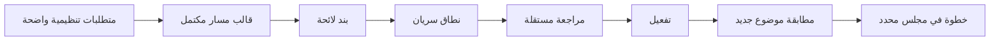
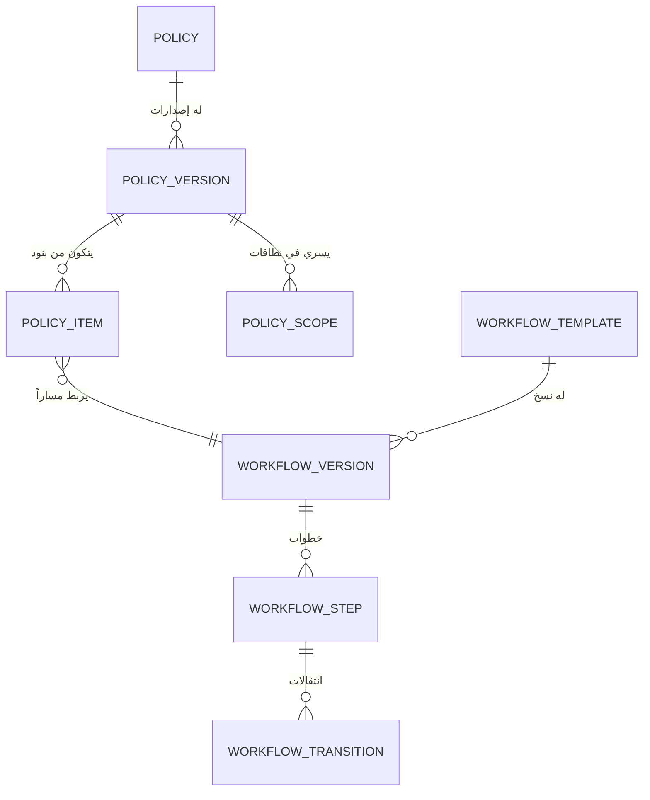
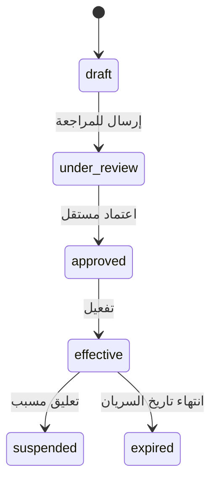

# دليل إعداد اللوائح والمسارات

هذا الدليل التنفيذي يشرح إعداد اللائحة من الصفر حتى تفعيلها واختبارها. اللائحة الفعالة ليست
نصًا مرجعيًا فقط، بل قاعدة تحدد أي مجلس يستقبل الموضوع، وما الإجراء المسموح، وكيف ينتقل.

## النتيجة المطلوبة

لكل لائحة فعالة يجب أن يمكن الإجابة بدقة: ما فئة الموضوع؟ وفي أي نطاق؟ وما المجلس الذي يبدأ
عنده؟ وما النتائج التي تنقله أو تنهيه؟ إذا غاب أحد هذه الإجابات، فلا تنشر اللائحة.



## 1. ما يجب تجهيزه قبل البدء

### الهيكل والعضويات

| التجهيز | الغرض |
|---|---|
| مجالس ولجان فعالة | كل خطوة ترتبط بمجلس محدد أو بتصنيف مجلس. |
| شجرة المجالس | لازمة للنطاقات الهرمية واختيار المجلس الأقرب. |
| نوع المجلس ومستواه | تستخدمه النطاقات بحسب النوع أو المستوى. |
| تصنيفات المجالس | تمكن الخطوة من اختيار مجلس من تصنيف، بدل اسم ثابت. |
| عضويات فعالة وصفات رئيس ومقرر وعضو | تحدد من ينفذ الخطوات ويحضر ويصوت ويعتمد المحضر. |
| فئات موضوعات فعالة | تحدد ما الذي يطابق بند اللائحة. |

### الأدوار والصلاحيات

| الصلاحية | المسؤولية |
|---|---|
| `governance.policies.manage` | إنشاء اللائحة والإصدار والبنود والنطاقات وإرسالها للمراجعة. |
| `governance.policies.approve` | اعتماد الإصدار وتفعيله وتعليقه. |
| `governance.workflows.manage` | إدارة القوالب والنسخ والخطوات والانتقالات. |
| `topics.create` | إنشاء موضوع في المجلس الحالي ومطابقته. |
| `topics.review` أو صلاحية الخطوة | تنفيذ خطوة الموضوع في مجلسها. |

معتمد الإصدار يجب أن يكون شخصًا مختلفًا عن الشخص الذي أرسله للمراجعة.

### قرارات يجب اعتمادها إداريًا

1. فئة الموضوعات التي تنطبق عليها اللائحة.
2. مجلس البداية لكل فئة ونطاق.
3. هل الخطوة لمجلس ثابت أم لتصنيف مجلس يحل تلقائيًا.
4. نتائج كل خطوة: اعتماد، إرجاع، رفض، اكتمال، إلغاء.
5. هل توجد خطوة تصويت، وما معالجة التعادل وعدم وجود أصوات.
6. هل يسمح بمسار بديل أو مخصص، وما تاريخ سريانه.

## 2. علاقة المكونات



التسلسل الصحيح: **قالب مسار صالح، ثم بند لائحة، ثم نطاق، ثم مراجعة واعتماد وتفعيل**.
لا يعدل إصدار مرسل للمراجعة أو مستخدم تاريخيًا؛ ينشأ إصدار جديد.

## 3. إنشاء قالب المسار

### 3.1 القالب والنسخة

استخدم `admin_create_workflow_template` لإنشاء القالب وأول نسخة مسودة:

```json
{
  "p_code": "ACADEMIC_APPROVAL",
  "p_name_ar": "مسار اعتماد الموضوعات الأكاديمية",
  "p_name_en": null,
  "p_description": "مراجعة ثم تصويت عند الحاجة."
}
```

استخدم `admin_create_workflow_version` عند تغيير الخطوات أو النتائج. لا تعدل النسخة الفعالة.

### 3.2 إضافة الخطوات

لكل خطوة استخدم `admin_add_workflow_step`. اختر أحد الخيارين فقط:

- `p_governance_unit_id`: مجلس ثابت.
- `p_governance_class_id`: مجلس يحل من تصنيف مناسب في سياق الموضوع.

```json
{
  "p_workflow_template_version_id": "uuid",
  "p_step_code": "faculty_review",
  "p_name_ar": "مراجعة مجلس الكلية",
  "p_sequence_no": 10,
  "p_step_type": "review",
  "p_responsibility": "review",
  "p_governance_unit_id": "uuid",
  "p_governance_class_id": null,
  "p_required_permission_code": "topics.review",
  "p_is_initial": true,
  "p_is_terminal": false,
  "p_entry_conditions": {},
  "p_exit_conditions": {},
  "p_allowed_outcomes": ["approved", "returned", "rejected"]
}
```

| الخاصية | القيم المدعومة |
|---|---|
| نوع الخطوة | `review`, `discussion`, `recommendation`, `approval`, `voting`, `execution`, `follow_up` |
| المسؤولية | `present`, `review`, `discuss`, `recommend`, `initial_approve`, `final_approve`, `execute`, `follow_up` |
| النتائج | `approved`, `rejected`, `returned`, `tie`, `no_vote`, `cancelled`, `completed` |
| نوع الانتقال | `forward`, `return`, `reject`, `complete`, `cancel` |

### 3.3 الانتقالات والتحقق

أضف انتقالًا لكل نتيجة غير نهائية عبر `admin_add_workflow_transition`:

```json
{
  "p_workflow_template_version_id": "uuid",
  "p_from_step_id": "uuid",
  "p_outcome_code": "approved",
  "p_to_step_id": "uuid",
  "p_transition_type": "forward",
  "p_conditions": {}
}
```

يفرض التحقق بداية واحدة، نهاية قابلة للوصول، وعدم وجود خطوة معزولة أو نتيجة بلا انتقال.
فعّل النسخة المكتملة بـ`admin_activate_workflow_template_version`.

### 3.4 التصويت

استخدم `voting` عندما تحسم النتيجة بجولة تصويت. يجب تعريف الانتقالات الأربع:
`approved`, `rejected`, `tie`, `no_vote`. لا تكمل الواجهة الخطوة يدويًا؛ إغلاق جولة التصويت
هو الذي يحرك المسار.

### 3.5 الشروط

تقبل حقول المطابقة والدخول والخروج والانتقال كائن JSON. تطابق القيم سياق الموضوع والمجلس
بدقة، وتدعم `all` و`any` و`not`:

```json
{
  "all": [
    { "priority": "high" },
    { "any": [{ "source_type": "new" }, { "source_type": "from_upper_unit" }] }
  ]
}
```

استخدم حقول السياق فقط مثل `priority`, `source_type`, `topic_category_id`,
`governance_unit_id`, `governance_class_id`, `governance_level`, و`governance_unit_type_id`.

## 4. إنشاء اللائحة والإصدار والبنود

### 4.1 هوية اللائحة

استخدم `admin_create_policy` مرة واحدة للهوية المستقرة. الأنواع: `regulation`, `policy`,
`procedure`, `framework`.

```json
{
  "p_code": "ACADEMIC_REGULATION",
  "p_name_ar": "اللائحة الأكاديمية",
  "p_name_en": null,
  "p_policy_type": "regulation",
  "p_description": "قواعد تمرير الموضوعات الأكاديمية بين المجالس.",
  "p_owner_user_id": "uuid"
}
```

### 4.2 الإصدار

أنشئ مسودة بـ`admin_create_policy_version` لكل تعديل قانوني أو تشغيلي:

```json
{
  "p_policy_id": "uuid",
  "p_version_label": "2026.1",
  "p_change_summary": "إصدار أول لمسار اعتماد الخطط الأكاديمية."
}
```

### 4.3 بند اللائحة

يربط البند فئة موضوع ومسارًا ونمط حوكمة. أضفه بـ`admin_add_policy_item`:

```json
{
  "p_policy_version_id": "uuid",
  "p_item_code": "ACADEMIC_PLAN",
  "p_title_ar": "اعتماد الخطة الأكاديمية",
  "p_sort_order": 10,
  "p_parent_item_id": null,
  "p_item_type": "article",
  "p_title_en": null,
  "p_body_text": "تسلك الخطة المسار المعتمد.",
  "p_governance_mode": "regulation_required",
  "p_topic_category_id": "uuid",
  "p_match_criteria": {"priority": "high"},
  "p_workflow_template_version_id": "uuid"
}
```

قيم نوع البند: `chapter`, `section`, `article`, `clause`, `procedure`.

| نمط الحوكمة | الاستخدام |
|---|---|
| `regulation_required` | لا يبدأ الموضوع دون مسار لائحي صالح. |
| `regulated_fallback_allowed` | يسمح بطلب مسار بديل عند تعذر تشغيل المسار الثابت. |
| `custom_route_allowed` | يسمح بمسار مخصص يخضع لمراجعة مستقلة. |

## 5. نطاق السريان والاستثناءات

أضف نطاقًا بـ`admin_set_policy_scope` لكل مكان تنطبق فيه اللائحة.

| `p_scope_type` | قيمة الإدخال |
|---|---|
| `organization` | لا معرف ولا مستوى |
| `governance_unit_type` | معرف نوع المجلس |
| `governance_level` | مستوى حوكمي |
| `governance_class` | معرف تصنيف مجلس |
| `governance_unit` | معرف مجلس محدد |
| `unit_subtree` | معرف المجلس الجذر |

مثال لمجلس محدد:

```json
{
  "p_policy_version_id": "uuid",
  "p_scope_type": "governance_unit",
  "p_target_id": "uuid",
  "p_governance_level": null,
  "p_include_descendants": false,
  "p_priority": 0,
  "p_valid_from": null,
  "p_valid_to": null
}
```

`p_include_descendants=true` صالح فقط مع `unit_subtree`. عند الحاجة إلى تضمين أو استبعاد مجلس
معين داخل نطاق أوسع، استخدم `admin_set_policy_item_scope_override` مع سبب ومدة عند الحاجة.

ترتيب المطابقة: مجلس محدد، ثم تصنيف مجلس، ثم مستوى، ثم نوع، ثم فرع، ثم مؤسسة. الأولوية الرقمية
تستخدم داخل المستوى نفسه فقط؛ لا تجعل نطاقًا عامًا يتغلب على نطاق خاص.

## 6. المراجعة والاعتماد والتفعيل



1. `admin_submit_policy_for_review`: يتطلب بندًا نشطًا ونطاقًا نشطًا. البنود الإلزامية تحتاج
   مسارًا فعالًا ومتحققًا لتصبح جاهزة.
2. `admin_approve_policy_version`: يرفض اعتماد مقدم الإصدار لإصداره.
3. `admin_activate_policy_version`: يتطلب إصدارًا `approved` وحالة تشغيلية `ready` وتاريخ بدء.
4. `admin_suspend_policy_version`: يتطلب سببًا لا يقل عن عشرة أحرف.

## 7. سيناريوهات جاهزة

### أ. قاعدة لمجلس محدد

كل موضوع «خطة أكاديمية» ينشأ في كلية العلوم يمر بمراجعة الكلية ثم تصويت المجلس:

1. أنشئ قالب مراجعة ثم تصويت، وحدد انتقالات نتائج التصويت الأربع.
2. فعّل نسخة القالب.
3. أنشئ بندًا لفئة الخطة واربطه بالمسار.
4. أضف نطاق `governance_unit` لكلية العلوم.
5. أرسل الإصدار واعتمده مستخدم مستقل ثم فعّله.

### ب. قاعدة عامة واستثناء كلية

تنطبق قاعدة على كل الكليات، لكن كلية الطب لها مسار مختلف:

1. أضف نطاقًا عامًا بحسب المستوى أو النوع.
2. استبعد كلية الطب من البند العام بـ`is_included=false` عند الحاجة.
3. أضف بندًا ونطاقًا خاصين بكلية الطب مرتبطين بالمسار المختلف.
4. اختبر موضوعًا لكلية الطب وآخر لكلية مختلفة.

### ج. مسار بديل مصرح به

عندما يسمح البند بمسار مخصص:

1. اختر `regulated_fallback_allowed` أو `custom_route_allowed`.
2. عند تعذر المسار الثابت، يقدم المخول `request_custom_workflow` بسبب مفصل وتاريخ انتهاء.
3. يعتمد شخص مستقل الطلب بـ`approve_custom_workflow`.
4. عند انتهاء الصلاحية يتوقف المسار ولا تنفذ خطوة جديدة حتى طلب وتجديد مراجع.

### د. تعارض لائحتين

إذا تساوت قاعدتان في المطابقة، تظهر `multiple_policy_conflict`. لا تختار الواجهة لائحة عشوائيًا؛
صحح النطاق أو المعيار أو اطلب استثناءً مراجعًا.

## 8. اختبار ما قبل النشر

| الاختبار | النتيجة المطلوبة |
|---|---|
| نطاق خاص وعام | يفوز النطاق الخاص. |
| استبعاد مجلس | لا يطبق البند المستبعد. |
| تضمين مجلس | يفوز التضمين الصريح. |
| شرط مطابقة | يطابق فقط سياق الموضوع الصحيح. |
| تعارض | نتيجة تعارض بلا اختيار صامت. |
| تصويت | انتقال صحيح لكل من الموافقة والرفض والتعادل وعدم الأصوات. |
| استقلال المراجع | رفض اعتماد مقدم الإصدار لنفسه. |

استعمل `resolve_topic_governance` للمعاينة، ثم بعد إنشاء موضوع تجريبي تحقق من
`get_topic_governance` و`get_topic_workflow`. لا تفعّل الإصدار قبل نجاح هذه الاختبارات.

## 9. تعديل لائحة منشورة

1. أنشئ نسخة مسار جديدة عند تغير الخطوات أو المجالس أو النتائج.
2. أنشئ إصدار لائحة جديدًا عند تغير البنود أو النطاقات أو القاعدة.
3. راجعه واعتمده وفعّله بتاريخ واضح.
4. اترك الموضوعات السابقة على اللقطة التي بدأت بها؛ لا تعيد كتابة تاريخها.

## 10. معالجة المشكلات

| العرض | السبب المحتمل | الإجراء |
|---|---|---|
| لا يمكن الإرسال للمراجعة | لا بند أو نطاق نشط | أكمل البند والنطاق. |
| لا يمكن التفعيل | المسار غير فعال أو الإصدار غير جاهز | صحح القالب ثم أعد المراجعة. |
| الموضوع محجوب | لا مطابقة أو تعارض أو شرط غير متحقق | اقرأ نتيجة المطابقة ولا تدرجه في اجتماع. |
| لا تظهر الخطوة للمجلس | مجلس الخطوة أو تصنيفه غير صحيح | راجع المجلس المحلول في المسار. |
| لا يفتح التصويت | الخطوة ليست `voting` أو شروط الاجتماع ناقصة | صحح القالب أو استكمل شروط الاجتماع. |

## المراجع

- [عقود اللوائح والمسارات](../api/15-regulations-workflows.md)
- [مرجع العقود](../api/12-contract-reference.md)
- [عقود الاستجابات](../api/14-json-response-contracts.md)
